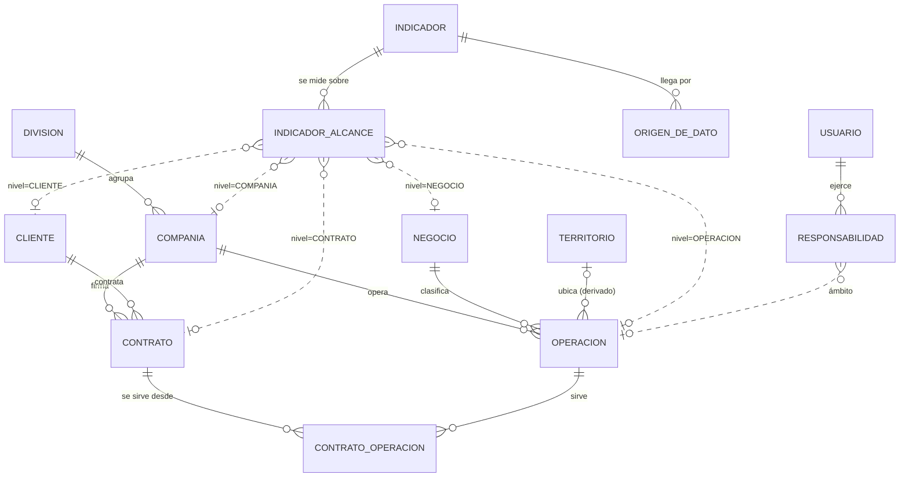

# El modelo de datos del maestro

**Entidades, relaciones y el diccionario. El DDL ejecutable está en
[`02_esquema.sql`](02_esquema.sql); este documento explica el porqué de cada mesa.**

---

## 1 · El diagrama

Las líneas punteadas son el **patrón de nivel**: `indicador_alcance` y `responsabilidad`
apuntan a un `(nivel, nivel_id)` en vez de a una tabla fija. Es lo que permite decir «este
indicador se mide en toda la compañía» o «esta persona consulta todo el negocio» sin una
tabla puente por cada combinación.

> **Por qué no llaves foráneas polimórficas «de verdad»:** PostgreSQL no las valida. La
> integridad del par `(nivel, nivel_id)` se garantiza en el servicio (§03) y en las vistas
> de resolución — el mismo lugar donde ya vive el alcance de tres capas del producto.

---

## 2 · Las decisiones de modelado, una por una

### El cliente se llega por el contrato

`cliente → contrato → contrato_operacion → operacion`. Nunca cliente→operación directo.

Una operación dedicada es un contrato con una operación. Un sitio multicliente —los
«Multicuentas» de SID, los CEDIS de Medistik— es **varios contratos compartiendo la misma
operación**. El modelo directo habría forzado a elegir un cliente por sitio, que es
exactamente la mentira que los nombres de operación cuentan hoy.

`contrato_operacion` lleva vigencia propia: un cliente que se muda de CEDIS es un renglón
que se cierra y otro que se abre, no un `UPDATE` que borra la historia.

### El alcance con nivel, y su resolución

`indicador_alcance (indicador, nivel, nivel_id, desde, hasta)`. La vista
`v_alcance_resuelto` lo baja a operaciones concretas:

| nivel | resuelve a |
|---|---|
| `OPERACION` | esa operación |
| `COMPANIA` / `NEGOCIO` | todas sus operaciones activas |
| `CONTRATO` | las operaciones vigentes en `contrato_operacion` |
| `CLIENTE` | las operaciones de todos sus contratos vigentes |

**De esta resolución salen los envíos esperados** — la invariante nº 1. La cobertura actual
de Captura (`IndicadorAplicaA`, sólo operaciones) es el caso `nivel = OPERACION`, así que la
migración es un `INSERT … SELECT`.

### El origen del dato es una fila con vigencia, no un atributo

`origen_de_dato (indicador, canal, sistema_origen, semana_de_transicion, estado_conexion,
desde, hasta)`. Hoy los 23 indicadores tienen una fila `MANUAL / PENDIENTE`. Cuando el WMS
tome L02, la fila manual se cierra y se abre una `AUTOMATIZADO / CONECTADO` — y la historia
de cuándo ocurrió queda escrita, que es justo lo que la transición necesita poder demostrar.

### La responsabilidad con verbo

Tres verbos, una tabla. La alternativa —roles globales como los de Captura— no puede decir
«García administra los catálogos de Medistik pero sólo consulta el resto», y esa frase es
el caso normal de una división con 9 compañías.

El rol global de Captura no desaparece: se **deriva**. `CAPTURA` en alguna vigencia → puede
capturar ahí; `ADMINISTRA × DIVISION` → es el administrador. La sesión resuelve el verbo
contra el ámbito, en el servidor, como siempre.

### El origen del registro, en cada maestro

`origen_del_registro ∈ {SEMILLA, DERIVADO, MANUAL, EJEMPLO}` en división, compañía, negocio,
territorio, cliente, contrato, usuario y responsabilidad. Es la quinta regla convertida en
columna: la consola pinta la insignia desde el dato, no desde una lista aparte que se
desactualiza.

---

## 3 · Diccionario abreviado

Las columnas completas están en el DDL con sus `COMMENT ON`. Lo no obvio:

| tabla · columna | por qué existe |
|---|---|
| `negocio.clase` | Nula al nacer. La semilla trae 4 unidades de negocio sin clase; adivinarla sería inventar |
| `operacion.sitio` | El sitio físico cuando el nombre lo trae («Multicuentas Tultitlán»); permite agrupar multicliente |
| `operacion.sistema_declarado` | `NULL` = «Sin información» (46). ⚠️ Otras 44 dicen «Sistema independinete»; el 90 publicado las suma — decisión de catálogo pendiente |
| `cliente.estado` | `POR_CONFIRMAR` en los 87 derivados. Confirmar o **fusionar** («Samsung» / «Samsung PIQ» / «SDS Samsung», ¿uno o tres?) es trabajo del administrador |
| `contrato.desde/hasta` | Sin moneda ni tarifa **a propósito**: no existe el dato. Cuando Comercial lo traiga, se agregan las columnas y habilitan `fact_ingreso` |
| `indicador_alcance.desde/hasta` | La cobertura también tiene historia: «¿desde cuándo se le pide L02 a esta compañía?» |
| `responsabilidad.origen` | `DERIVADO` para lo que salió de los contactos del análisis — que son punto de partida, no asignación |

---

## 4 · Correspondencia con CoreTX Captura

Captura no se rompe: se vuelve consumidor. Tabla por tabla:

| en Captura hoy | en el maestro | migración |
|---|---|---|
| `Division`, `Compania` | `division`, `compania` | 1:1 — mismos ids |
| `Operacion` | `operacion` (+ `negocio_id`, `territorio_id`, `sitio`) | 1:1 + columnas nuevas nulas |
| `Operacion.unidad_de_negocio` (texto) | `negocio` (tabla) | los 4 distintos se vuelven filas |
| — | `territorio`, `cliente`, `contrato`, `contrato_operacion` | nuevas |
| `Indicador` (con campos y reglas) | `indicador` (identidad y taxonomía) | los **campos, fórmulas y 239 reglas se quedan en Captura**: son del conector manual, no del maestro |
| `IndicadorAplicaA` | `indicador_alcance` con `nivel = OPERACION` | `INSERT … SELECT` |
| `Asignacion` (ámbito OPERACION/GRUPO) | `responsabilidad` verbo `CAPTURA` | OPERACION → directo; GRUPO×compañía → `CAPTURA × COMPANIA` con nota del grupo |
| `Usuario.rol` | derivado de `responsabilidad` | ADMIN → `ADMINISTRA × DIVISION`, etc. |
| `Usuario.puede_analizar` | `CONSULTA` sobre el ámbito que corresponda | permiso → verbo |
| — | `origen_de_dato` | nueva; se puebla del `destino` de la semilla |

**La línea divisoria**: el maestro guarda **estructura e identidad**; Captura guarda **el
mecanismo de capturar** (campos, reglas, ventanas, bitácora). Los envíos y su bitácora no se
mueven — se espejan al lake, donde viven las preguntas.

---

## 5 · Los datos con los que nace

`herramientas/derivar_maestro.py` puebla el maestro desde la semilla, determinista:

| qué | cuántos | origen marcado |
|---|---:|---|
| División · compañías · operaciones | 1 · 9 · 141 | `SEMILLA` |
| Negocios | 4 | `DERIVADO` (de la unidad de negocio) |
| Territorios | 5 | `DERIVADO` (de los sufijos de SID) |
| Clientes | 87 | `DERIVADO` · `POR_CONFIRMAR` |
| Contratos | 87 | **`EJEMPLO`** |
| Indicadores | 23 | `SEMILLA` (+ taxonomía sin firmar) |
| Alcances (nivel OPERACION) | 2,577 renglones | la reconstrucción documentada de la cobertura |
| Orígenes de dato | 23 | `MANUAL / PENDIENTE`, con su semana de transición |
| Responsables | 9 | `CONTACTO` — los contactos del análisis, que no son asignación |
